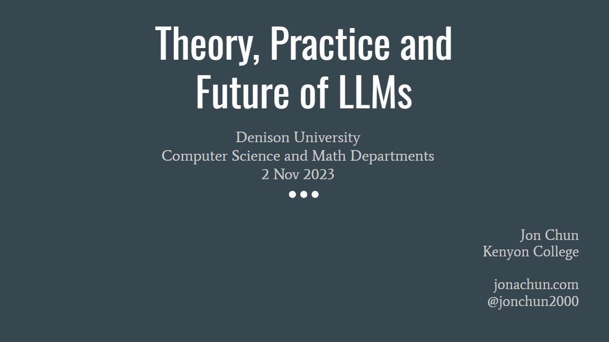

# The Theory, Practice and Future of Large Language Models (LLMs)
* 2 Nov 2023
* Denison University
* Computer Science and Math Departments

### Presentation

* [Theory, Practice and Future of LLMs *.ppt](./DenisonU_CSMath_Theory_and_Practice_of_LLMs_20231102.pptx)

* [Theory, Practice and Future of LLMs *.pdf](./DenisonU_CSMath_Theory_and_Practice_of_LLMs_20231102.pdf)

### Description

What is the evolving theory, current industry practices and future research directions of Large Language Models as of November 2023? How does this relate to undergraduate computer science and math studies.

